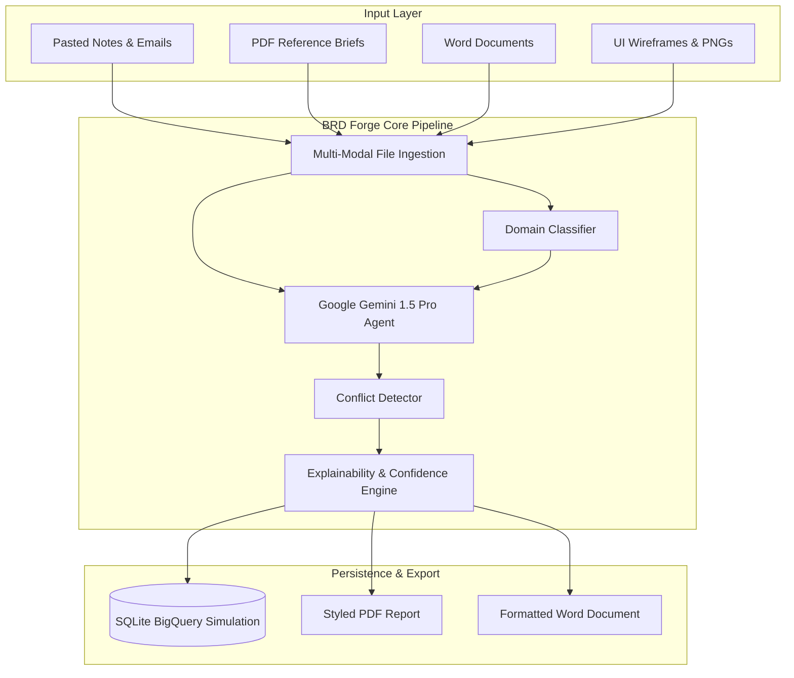

# 🔬 BRD Forge — Turn Chaos Into Clarity
### AI-Powered Multi-Modal Business Requirements Document (BRD) Generation Agent

**BRD Forge** is a prototype application that takes fragmented, multi-modal project inputs (pasted text, meeting briefs, document files, wireframes, and diagrams) and synthesizes them into structured, traceably explained, and conflict-checked Business Requirements Documents.

Built by team **Useless AI** for the Google AI Hackathon.

---

## 🏛️ System Architecture & Workflow



---

## 🚀 Key Features

1. **Multi-Modal File Parsing**: Extract text and implied details from PDFs, images, and documents.
2. **Domain-Specific Adjustments**: Classify the business domain (e.g. FinTech, HealthTech, EdTech) to automatically suggest regulatory standard lists (HIPAA, PCI-DSS) and custom glossary terms.
3. **Automated Conflict Detection**: Performs cross-validation checking to identify contradictory constraints (e.g. SSO single sign-on vs password auth only).
4. **Explainability Tracing**: Attaches source attribution to every requirement generated, outlining exactly which file and line section it was derived from.
5. **Confidence Scoring**: Computes a HIGH/MEDIUM/LOW confidence rating based on how well corroborated the requirement is across different inputs.
6. **SQLite Archive Database**: Simulates enterprise BigQuery tables to save BRDs, reload past generations, delete rows, and manage revisions.
7. **Professional Exporters**: Download the final generated document directly as a styled PDF (via ReportLab with running page numbers) or a editable DOCX document.

---

## 📂 Project Structure

```
brd-forge/
├── app.py                  # Main Streamlit application
├── requirements.txt        # Python dependency declarations
├── .env                    # Environment key file template
├── config.py               # Theme colors, thresholds, paths configurations
├── core/
│   ├── ingestion.py        # Stream-based file parsers
│   ├── gemini_agent.py     # Gemini client orchestration
│   ├── brd_generator.py    # Multi-step BRD generation flow
│   ├── conflict_detector.py # Pairing contradictions checking
│   ├── explainability.py   # Confidence metrics and source trace logging
│   └── domain_classifier.py # Domain heuristic matching
├── database/
│   └── db_handler.py       # SQLite BigQuery simulator DB layer
├── utils/
│   ├── pdf_parser.py       # PDFMiner / PyPDF text parser
│   ├── image_analyzer.py   # PIL image analyzer
│   └── export.py           # ReportLab PDF & python-docx Word exporters
├── uploads/                # Local file upload scratch folder
├── outputs/                # Exporter generated artifacts
├── sample_inputs/          # Sample documents for sandbox demo runs
└── README.md               # User guide documentation
```

---

## ⚙️ Installation & Local Setup

### Prerequisites
- Python 3.11 or later
- Visual Studio Build Tools (required by some PDF or image packages)

### 1. Clone & Navigate
```bash
git clone https://github.com/mukulpythondev/brd-forge.git
cd brd-forge
```

### 2. Configure Environment
Rename `.env` and configure your API key details:
```env
GEMINI_API_KEY=your_gemini_api_key_here
APP_NAME=BRD Forge
APP_VERSION=1.0.0
DEBUG=False
MAX_FILE_SIZE_MB=10
MAX_FILES_PER_session=10
DEMO_MODE=True
```
> **Note:** If `GEMINI_API_KEY` is not configured, the app will run in **DEMO_MODE=True** by default, returning high-fidelity simulated bank portal output.

### 3. Install Dependencies
```bash
pip install -r requirements.txt
```

### 4. Run Locally
Execute the Streamlit web server:
```bash
streamlit run app.py
```

---

## 👥 Hackathon Team: Useless AI
- **Mukul Rana**
- **Manideep Bishnoi**
- **Shanu Prajapati**
