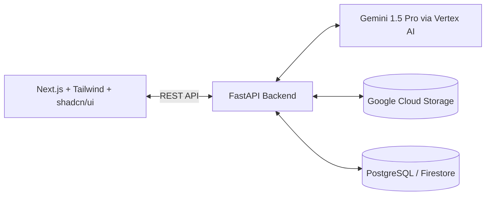

# 💻 BRD Forge — Tech Stack Evaluation & Recommendations Report

This report evaluates the current technology stack used in **BRD Forge**, discusses its limitations, and details recommendations to upgrade the stack to build a high-performing, visually stunning, and competitive hackathon submission.

---

## 🔍 1. Current Tech Stack Analysis

Here is a breakdown of the libraries and technologies currently implemented in the prototype:

| Component | Technology / Library | Role in Project | Suitability Score |
| :--- | :--- | :--- | :--- |
| **Frontend UI** | `Streamlit (v1.35.0)` | Renders pages, sidebar navigation, form inputs, and previews. | 🟡 **6/10** (Fast to build, but visually rigid and lacks advanced interactive UI elements) |
| **AI Orchestration** | `google-generativeai (v0.7.2)` | Connects to Google's Gemini 1.5 Pro API for text/image analysis. | 🟢 **9/10** (Standard SDK, but could utilize Vertex AI for enterprise integrations) |
| **Local Database** | `SQLite3` (via Python stdlib) | Stores generated BRD payloads, project details, and version histories. | 🟡 **5/10** (Perfect for local development, but does not showcase Google Cloud scalability) |
| **Document Ingestion** | `PyPDF2`, `python-docx`, `Pillow` | Extracts text from PDFs and Word briefs; processes wireframe images. | 🔴 **4/10** (PyPDF2 is outdated/deprecated and ruins layout formatting. Gemini can read PDFs natively!) |
| **Export Engines** | `ReportLab (v4.2.0)`, `python-docx` | Dynamically generates structured PDFs and Word documents from JSON data. | 🟢 **8/10** (Very powerful libraries for generating downloads) |

---

## ⚠️ 2. Core Limitations of the Current Stack

1.  **Outdated PDF Text Ingestion (`PyPDF2`):**
    *   `PyPDF2` is deprecated (superseded by `pypdf`).
    *   It extracts text as a flat string, losing table structures, headers, and relative spacing.
    *   **The Gemini Advantage:** Gemini 1.5 Pro has a large context window and natively accepts PDF uploads. We don't need to extract text locally! We can pass the file bytes or a GCS link directly to Gemini, allowing it to preserve document layout, tables, and visual charts.
2.  **Rigid UI Layouts (Streamlit):**
    *   Streamlit executes the entire script from top to bottom on any user action, which limits smooth, stateful animations.
    *   Creating modern web elements (like draggable nodes for requirement tracing, real-time rich-text editors, or glassmorphic floating dashboards) is extremely difficult or requires complex custom HTML/JS hacks in Streamlit.
3.  **Local SQLite Databases:**
    *   SQLite is a single-file database. It cannot handle concurrent collaboration, is restricted to the local filesystem, and does not impress Google Hackathon judges who want to see **Google Cloud Platform (GCP)** products like **BigQuery** or **Firestore** used.
4.  **Heuristics-Based Logic:**
    *   The conflict checker (`core/conflict_detector.py`) uses hardcoded string matching (e.g., checking if `"sso"` and `"username & password"` are present). It cannot detect semantic conflicts (e.g., "The system must load in under 1 second" vs "The system must load in under 1000 milliseconds" - which are equivalent, or actual contradictions written in different phrasing).

---

## 🚀 3. Recommended Upgrades for a Winning Product

We have two main pathways to upgrade the project:

### Option A: The "GCP-Integrated Python" Stack (Fastest Upgrade)
*Maintain the existing Streamlit shell but swap the backend for live Google Cloud services.*
*   **AI Engine Upgrade:** Wrap Gemini calls in the standard **Vertex AI SDK**. Use **Structured Outputs** (JSON Schema) to guarantee Gemini returns valid JSON every time.
*   **Native PDF Processing:** Remove `PyPDF2` text extraction. Send the file bytes directly to the Gemini 1.5 API as a document input so Gemini reads layout, tables, and formatting natively.
*   **Database:** Migrate SQLite to **Google BigQuery** (simulated or real GCP connections) to log requirements for long-term analytics and dashboard graphing.
*   **Storage:** Save uploaded files to a **Google Cloud Storage (GCS)** bucket instead of local folder directories.
*   **Intelligent Conflicts:** Prompt Gemini to identify semantic contradictions dynamically, replacing rule-based heuristics.

### Option B: The "Premium Enterprise SaaS" Stack (Highly Recommended for Winner)
*Rebuild the app with a modern React frontend and a Python API backend. This creates a high-fidelity web application that stands out from typical Streamlit submissions.*

1.  **Frontend (Next.js / Vite + React):**
    *   Use **Tailwind CSS** and **shadcn/ui** or **Mantine** for high-quality dark mode and glassmorphism.
    *   Integrate **React Flow** to render requirements, source tracing, and conflicts as an interactive nodes graph. Users can visually click on a conflict, drag nodes, and link items together.
2.  **Backend (FastAPI):**
    *   Keep python's rich libraries for PDF rendering and AI agent loops, exposed via API endpoints.
    *   Enables asynchronous request handling and websocket connections for real-time AI progress bars.
3.  **Storage & DB (Firebase / Supabase + PostgreSQL):**
    *   Enables real-time collaboration so multiple team members can view and resolve requirements on the same BRD.
    *   Uses Firebase Authentication for secure user logins.
